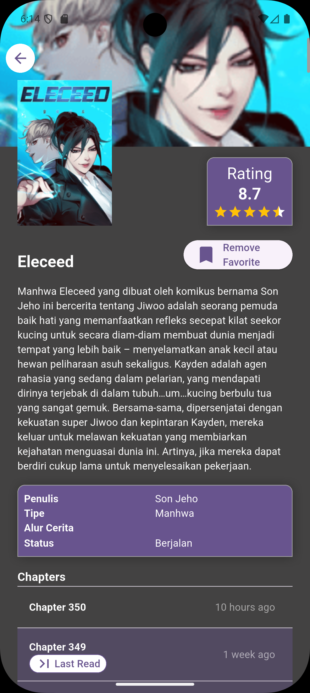
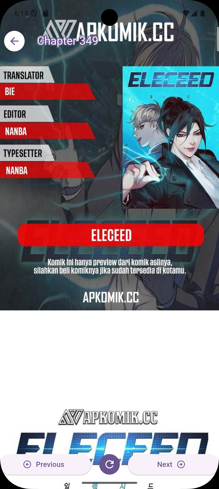
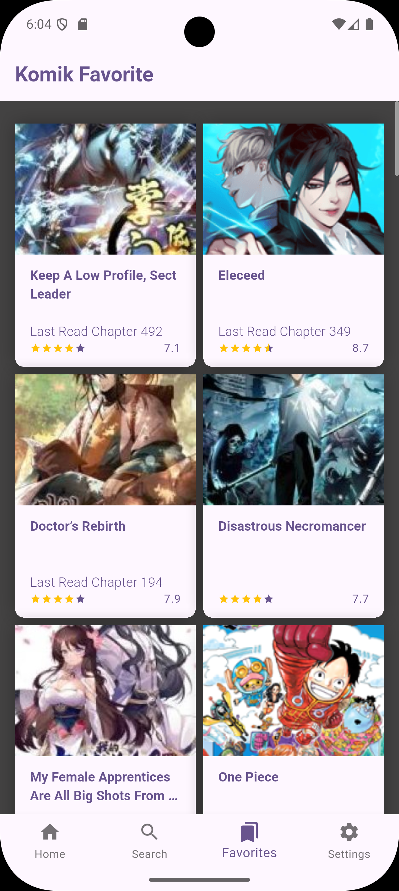
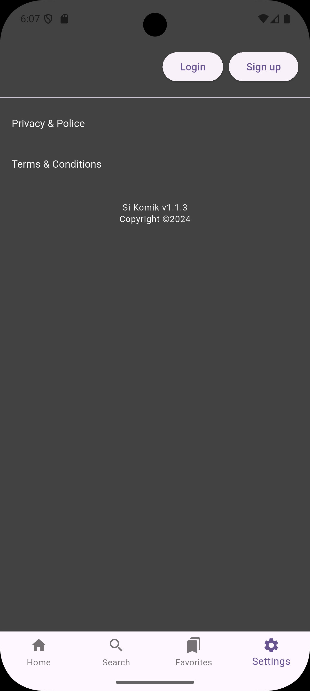

# SiKomik 📚

A modern comic reading application built with Flutter for reading manga, manhua, and manhwa in Indonesian language.

## Key Features ✨

- **Comic Reader**: Comfortable interface for reading various types of comics
- **Favorite Comics**: Save your favorite comics for easy access
- **Reading History**: Track the latest chapter you've read
- **All Read Chapters**: View all chapters you've already read
- **Responsive Design**: Optimized for various screen sizes
- **Indonesian Content**: Comics available in Indonesian language

## Supported Comic Types 📖

- **Manga**: Japanese comics
- **Manhua**: Chinese comics
- **Manhwa**: Korean comics

## Screenshots 📱








## Getting Started 🚀

### Prerequisites

- Flutter SDK (>=3.32.4)
- Dart SDK (>=3.8.1)
- Android Studio / VS Code
- Git

### Installation

1. **Clone the repository**
   ```bash
   git clone https://github.com/sempatpanick/sikomik.git
   cd sikomik
   ```

2. **Install dependencies**
   ```bash
   flutter pub get
   ```

3. **Run the application**
   ```bash
   flutter run
   ```

## Building 🔨

### Android
```bash
flutter build apk --release
```

### iOS
```bash
flutter build ios --release
```

## Project Structure 📁

```
lib/
├───common/
│   └───utils/
│       ├───remove_splash/
│       │   └───src/
│       └───url_strategy/
│           └───src/
├───data/
│   ├───datasources/
│   ├───models/
│   └───repositories/
├───domain/
│   ├───entities/
│   ├───repositories/
│   └───usecases/
├───generated/
└───presentation/
    ├───controllers/
    ├───pages/
    │   ├───browser_in_app/
    │   ├───chapter/
    │   │   ├───responsives/
    │   │   └───widgets/
    │   ├───comic_detail/
    │   │   └───responsives/
    │   ├───favorites/
    │   │   └───responsives/
    │   ├───home/
    │   │   └───responsives/
    │   ├───login/
    │   │   └───responsive/
    │   ├───main/
    │   │   └───responsives/
    │   ├───register/
    │   │   └───responsive/
    │   ├───search/
    │   │   └───responsives/
    │   └───settings/
    │       └───responsive/
    └───widgets/
```

**Architecture Overview:**
- **Common**: Shared utilities and configurations
- **Data**: Data sources, models, and repository implementations
- **Domain**: Business logic, entities, and use cases
- **Generated**: Auto-generated files (localization, etc.)
- **Presentation**: UI components, controllers, and pages with responsive design support

## Dependencies 📦

Key packages used in this project can be found in the `pubspec.yaml` file:

- Flutter SDK for main framework
- HTTP client for API requests
- State management for managing application state
- Image caching for image optimization
- Local storage for offline data storage

*For complete list of dependencies, please check the `pubspec.yaml` file*

## Contributing 🤝

Contributions are welcome! Please feel free to submit a Pull Request.

1. Fork the project
2. Create your feature branch (`git checkout -b feature/AmazingFeature`)
3. Commit your changes (`git commit -m 'Add some AmazingFeature'`)
4. Push to the branch (`git push origin feature/AmazingFeature`)
5. Open a Pull Request

## Development Guidelines 📋

- Follow Flutter's official style guide
- Write meaningful commit messages
- Add comments for complex logic
- Test your changes before submitting
- Update documentation when needed

## Technology Stack 🛠️

- **Framework**: Flutter
- **Language**: Dart
- **Platform**: Android & iOS
- **State Management**: GetX

## Support 💬

If you have any questions or issues, please:

- Open an issue on GitHub
- Contact the maintainer via email

## Acknowledgments 🙏

- Flutter team for the amazing framework
- All contributors who helped improve this project
- Indonesian comic reading community

---

**Made with ❤️ using Flutter**

*Don't forget to ⭐ this repository if you found it helpful!*